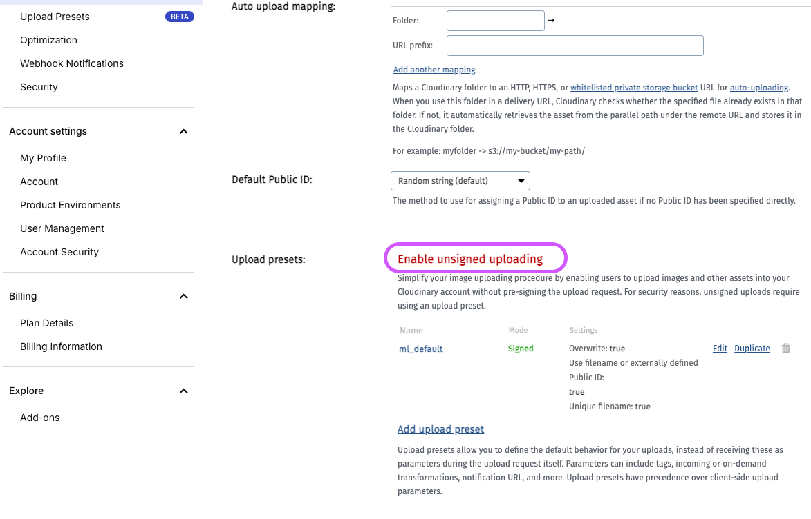
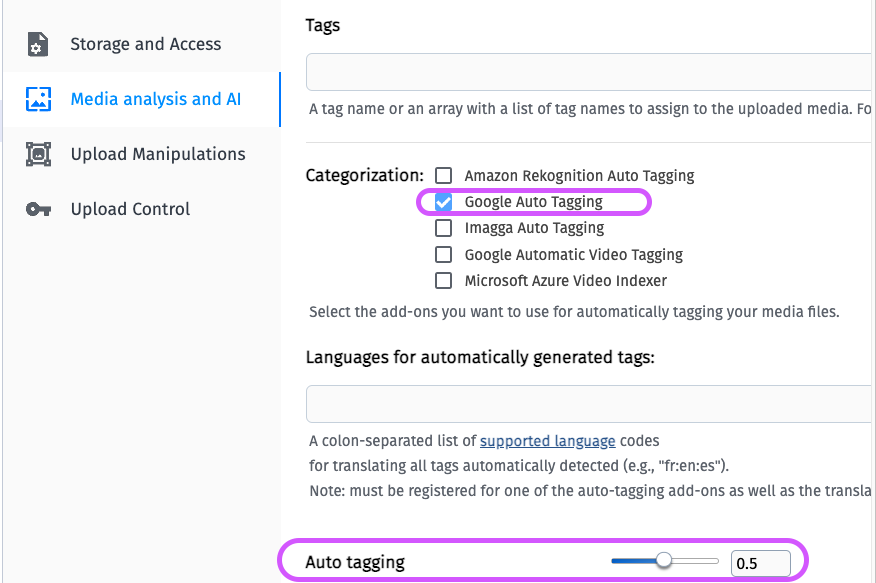
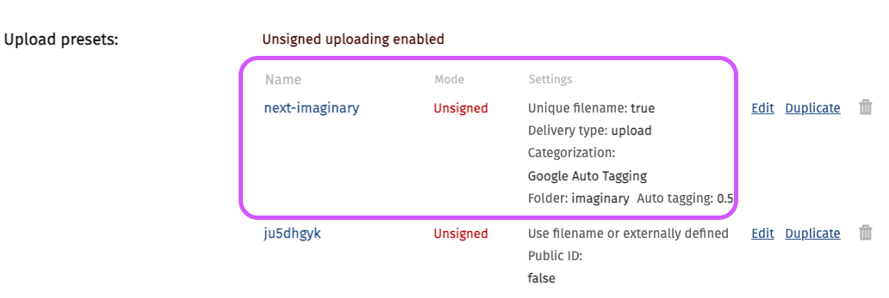
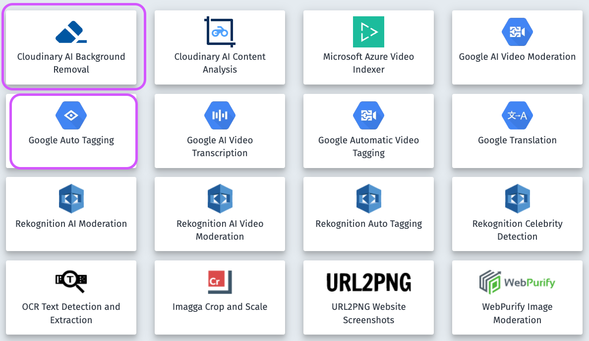

# Next Imaginary - AI-powered image generator and transformation

- Techstacks: NextJS, TailwindCSS, Typescript, Cloudinary AI, Clerk
- Important: This project uses experimental Next15, React Compiler, React 19 RC.
- Installtion: `npm i --legacy-peer-deps` or `npm i --force`
- Shadcn-UI with React 19: `npx --legacy-peer-deps shadcn-ui@latest add button`

## Clerk Authentication setup

- [NextJS Clerk Authentication](https://clerk.com/docs/quickstarts/nextjs)
- From version 5.x, [Clerk will not automatically protect all routes](https://clerk.com/docs/references/nextjs/clerk-middleware#protect-all-routes). We must specify which routes we want to protect:

```ts
const isPublicRoute = createRouteMatcher(["/sign-in(.*)", "/sign-up(.*)"]);

export default clerkMiddleware((auth, request) => {
  if (!isPublicRoute(request)) {
    auth().protect();
  }
});
```

- [List Of Clerk Environment Variables](https://clerk.com/docs/deployments/clerk-environment-variables#sign-in-and-sign-up-redirects)
- We need to sync Clerk login data with our DB,[Using Clerk Webhook](https://clerk.com/docs/integrations/webhooks/sync-data)
  

## Mongoose Models

- [Image model](./lib/database/models/Image.ts)
- After creating Image Schema, we can ask `ChatGPT` or `Claude` AI to create the exact Image Interface based on the Image schema.

## Shadcn notes

- Shadcn-UI with React 19: `npx --legacy-peer-deps shadcn-ui@latest add button`
- [Using Shadcn-UI with react hook form and zod](https://ui.shadcn.com/docs/components/form)
- Currently react-hook-form validation is not working properly with React 19
- We may either wait for future fix from react-hook-form team, or use a [workaround fix](https://github.com/orgs/react-hook-form/discussions/11832)

## SST Deployments

- Optimizing deployment to AWS Lambda with [OpenNext](https://opennext.org) and [SST](https://docs.sst.dev/start/nextjs):

```bash
cd my-app
npx create-sst@latest
npx sst dev
npm i --legacy-peer-deps
```

- Deploying with SST, we will need to specify the `sst.config.ts` file with Secret Manager values
- Inside the code base, we will need to [access env variables with Config](https://github.com/thangtran3112/neon-next-aws/blob/4bfdbffe147868961557aefd2419b327cd9adee6/src/app/lib/db.js#L13):

```ts
import { Config } from "sst/node/config";
const databaseUrl = Config.DATABASE_URL;
```

## Cloudinary

- To Use with NextJs, install `npm i next-cloudinary`
- Enable Unsigned Upload in Settings:
  
- Adjusting upload preset:
  
- Add Media analysis and AI with Google auto-tagging:
  
- Final Upload Preset will look like:
  
- Subscribe to Removal and Google Auto tagging feature (For descriptive searchs):
  

## Next Cloudinary

- [Using Next Cloudinary Upload](https://next.cloudinary.dev/clduploadwidget/basic-usage)
